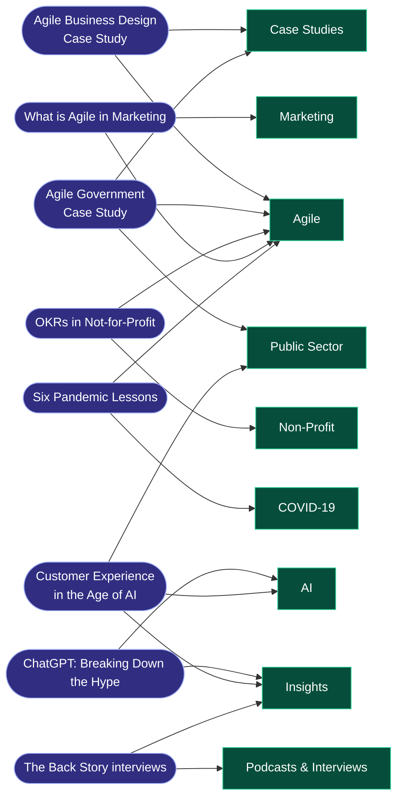
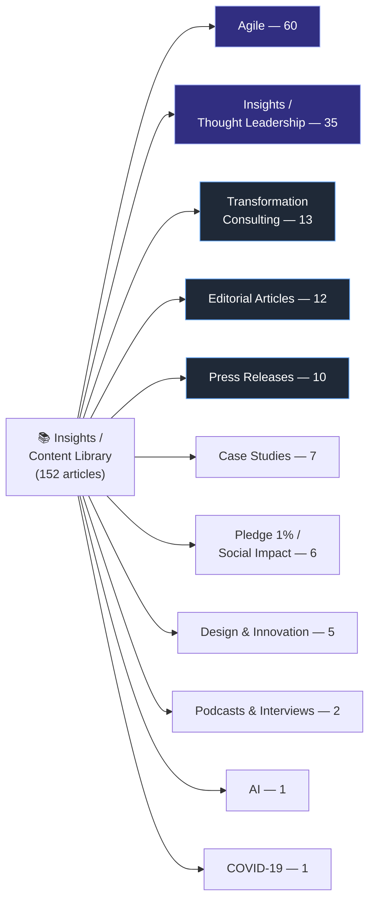
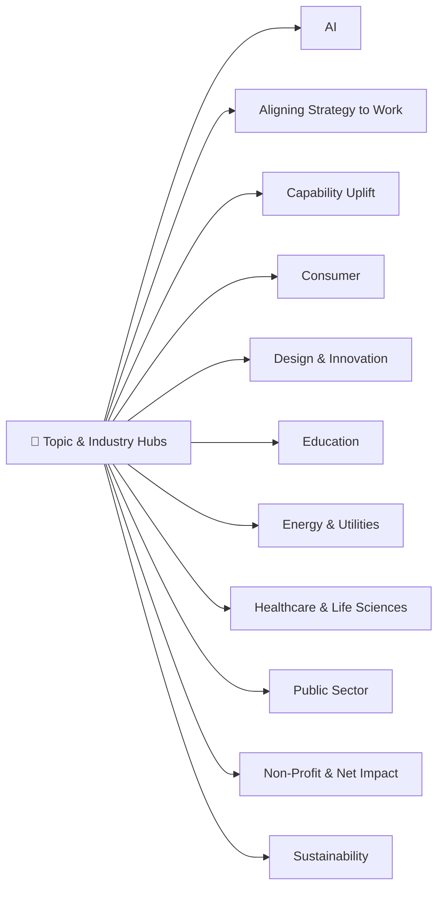
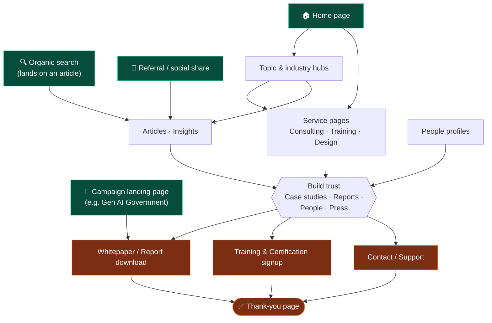

# Current Site Flowchart — adaptovate.com

> **Purpose:** Reference map of the **current** adaptovate.com site, derived from its
> [sitemap index](https://www.adaptovate.com/sitemap_index.xml), to understand the
> existing information architecture and user flow when designing the new site.
>
> **Source date:** 2026-06-07 · **Total URLs:** ~224

## Sitemap Overview

The site exposes four sitemaps under `sitemap_index.xml`:

| Sitemap | Count | Contents |
|---------|------:|----------|
| `page-sitemap.xml` | 37 | Core pages — services, training, about/careers, products, functions, industries |
| `post-sitemap.xml` | 152 | Articles & content, URL-prefixed by category (`/agile/`, `/insights/`, `/case-studies/`, …) |
| `people-sitemap.xml` | 24 | Team member profile pages (`/people/…`) |
| `adp-category-archives-sitemap.xml` | 11 | Topic & industry hub pages (`/ai/`, `/sustainability/`, `/public-sector/`, …) |

---

## Post ↔ Category Relationships (the site's web)

The key relationship to understand: **a single post belongs to multiple categories.**
Content is a many-to-many web, not a clean tree — one article can be Agile *and* a Case
Study *and* tied to an industry. This is why the same post can surface in several places.



> These multi-category links are **illustrative** — the sitemap exposes only one primary
> URL per post, so the cross-links above are inferred from each article's topic. The
> takeaway is the *shape*: content cross-cuts categories, so the new site needs a
> taxonomy that supports a post belonging to many categories at once.

---

## 1. Site Information Architecture (Structure)

How pages are organised. The site has a **service-led primary navigation**, a large
**content library** (Insights), **topic/industry hubs**, and **people profiles**.

```mermaid
flowchart TD
    Home(["🏠 Home /"])

    Home --> TC["Transformation<br/>Consulting"]
    Home --> TR["Training"]
    Home --> DT["Design Thinking"]
    Home --> PDM["Product Design<br/>& Management"]
    Home --> AG["Agile Hub"]
    Home --> PRD["Products"]
    Home --> FN["Functions"]
    Home --> IND["Industries"]
    Home --> AB["About Us"]
    Home --> INS["Insights /<br/>Content Library"]
    Home --> HUB["Topic & Industry<br/>Hubs"]
    Home --> PPL["People<br/>(24 profiles)"]

    %% Transformation Consulting
    TC --> TC1["Change Management"]
    TC --> TC2["Agile Transformation"]
    TC2 --> TC2a["Agile Consulting"]
    TC2 --> TC2b["Agile at Scale"]
    TC --> TC3["Strategy Consulting"]
    TC --> TC4["Business Agility Consulting"]

    %% Training
    TR --> TR1["Chapters Training"]
    TR --> TR2["Agile Leadership Training"]
    TR --> TR3["Agile Operating Model Training"]
    TR --> TR4["Business Agility Certification"]

    %% Design Thinking
    DT --> DT1["Design Sprints"]
    DT --> DT2["Empathy Mapping"]

    %% Product Design & Management
    PDM --> PDM1["Prototyping"]
    PDM --> PDM2["Test & Learn"]
    PDM --> PDM3["Roadmaps"]

    %% Agile
    AG --> AG1["Project Management"]

    %% Products
    PRD --> PRD1["Atlassian Partner"]
    PRD --> PRD2["BACI Products (Licence)"]

    %% Functions
    FN --> FN1["Marketing"]
    FN --> FN2["Technology"]
    FN --> FN3["Leadership"]

    %% Industries
    IND --> IND1["Public Sector"]

    %% About / Careers
    AB --> AB1["Careers"]
    AB1 --> AB1a["Employee Benefits<br/>(7 regions: AU, UK, PL, Connection,<br/>Growth, Wellbeing, Experiences)"]

    classDef hub fill:#1f2937,stroke:#60a5fa,color:#fff;
    classDef content fill:#312e81,stroke:#a5b4fc,color:#fff;
    class Home hub;
    class INS,HUB content;
```



### Standalone / utility pages
Not part of the main nav tree, but live in the sitemap:

- Campaign landing: `/lp-gen-ai-government/`
- Conversion: `/thank-you/`, `/artificial-intelligence-in-capital-intensive-industries-thank-you/`
- Misc content pages: `/dysfunctional-teams/`, `/growth-mindset/`, `/covid-19/`, `/events-2/`, `/support/`

---

## 2. Content Library — Categories (152 articles)

Articles are separated by their URL prefix into the categories below. **Agile** and
**Insights** dominate (~62% of all content).



### Category breakdown with examples

| Category | URL prefix | Count | Example articles |
|----------|------------|------:|------------------|
| **Agile** | `/agile/…` | 60 | "The Three Roles of Scrum Explained", "Agile Operating Model", "8 Red Flags When Adopting Agile" |
| **Insights / Thought Leadership** | `/insights/…` | 35 | "State of Agile 2024", "ChatGPT: Breaking Down the Hype", "The Back Story" interview series |
| **Transformation Consulting** | `/transformation-consulting/…` | 13 | "Why Agile Transformations Fail", "How to Measure an Agile Transformation", "Business Agility Consulting" |
| **Editorial Articles** | `/editorial-articles/…` | 12 | "Change is Constant", "8 Emerging Themes We've Seen in 2019", "Remote Workshops: It Can Be Done" |
| **Press Releases** | `/press-releases/…` | 10 | "Adaptovate Make the AFR Fast 100", "David Gumley Joins Adaptovate" |
| **Case Studies** | `/case-studies/…` | 7 | "EFMA", "HCD Bank Case Study", "Agile Government Case Study", "Financial Services" |
| **Pledge 1% / Social Impact** | `/pledge-1-percent/…` | 6 | "Giving Tuesday 2021", "Plan International Australia", "GOMO Foundation 2020" |
| **Design & Innovation** | `/design-and-innovation/…` | 5 | "Benefits of Design Sprints", "Test and Learn Within Agile Teams" |
| **Podcasts & Interviews** | `/podcasts-interviews/…` | 2 | "Interview with Lene Marx", "The Back Story – Lauren Mansfield" |
| **AI** | `/ai/…` | 1 | "Customer Experience in the Age of Artificial Intelligence" |
| **COVID-19** | `/covid-19/…` | 1 | "Six Pandemic Lessons That Will Improve Business" |

> ⚠️ **Note:** Some case studies and articles also live *under* `/agile/…` (e.g.
> "Agile Business Design Case Study"), so the categorisation by URL prefix is not
> perfectly clean — content type and URL folder don't always match. Worth normalising
> on the new site.

---

## 3. Topic & Industry Hubs (11 archive pages)

These category-archive pages act as **landing hubs** that aggregate related content by
theme or sector — a secondary, audience-based navigation layer alongside the
service-led primary nav.



---

## 4. User Journey Flow

How a visitor typically moves through the site — from **entry**, through
**explore / build trust**, to **conversion**.



**Reading the flow**
- **Entry** is multi-channel: most content traffic arrives on a deep article via search,
  not on the home page — so every article needs its own path toward trust + conversion.
- **Explore** splits into two navigation models: *service-led* (what we do) and
  *audience-led* (topic/industry hubs). The hubs feed back into both services and articles.
- **Trust** is the pivot: case studies, reports, press, and people profiles are what move
  a reader toward acting.
- **Conversion** funnels into three actions — contact, training signup, content download —
  all landing on a thank-you page.

---

## 5. Takeaways for the new site

1. **Content-heavy IA.** 152 articles across 11 categories dominate the site. The new site
   needs a clear content taxonomy and strong article → conversion paths (search is the main
   entry point).
2. **Two competing navigation models.** Service-led nav + audience-led topic/industry hubs
   overlap (e.g. "Design & Innovation" exists as both a service area and a hub). Consider
   consolidating or clearly distinguishing them.
3. **Inconsistent URL/category mapping.** Case studies and similar content are scattered
   across `/agile/`, `/case-studies/`, and `/insights/`. Normalise content types on the new site.
4. **Conversion funnels are thin.** Only generic `/thank-you/` pages. The new site can add
   clearer, category-specific CTAs and lead capture.
5. **People as trust assets.** 24 profiles + "The Back Story" interview series — surface
   these in the trust layer of key journeys.
```
