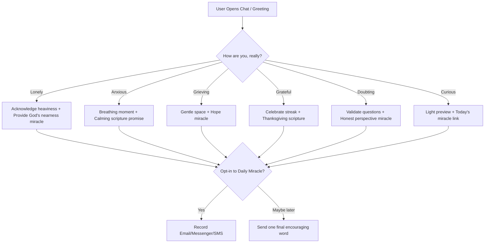

# Module F4: "Chat with Miracle" Companion — Technical Specification

This document specifies the script integrations, dynamic API triggers, conversational flows, and safety guardrails for **F4: "Chat with Miracle" companion**.

---

## 🎯 Objective
Establish an empathetic, conversational companion named **Miracle** using a visual chatbot widget (**Tidio** or **ManyChat**). The widget listens first, acts Taglish-friendly, addresses primary emotions, offers comfort/miracles, and channels users toward double opt-in subscriptions with zero custom AI model overhead.

---

## 📁 Files to Create / Modify

1. **[MODIFY]** [layout.tsx](file:///c:/RepoOutside/himala/src/app/layout.tsx) — Load the widget script asynchronously.
2. **[NEW]** [ChatTrigger.tsx](file:///c:/RepoOutside/himala/src/components/landing/ChatTrigger.tsx) — Codebase buttons that open the chat widget.

---

## 🛠️ Step-by-Step Code Specifications

### 1. Script Integration (`layout.tsx`)
Rather than blocking first-paint, inject the chat script lazily using Next.js `Script` tags.

```tsx
import Script from "next/script";

// Inside RootLayout:
<Script
  src="//code.tidio.co/your-unique-widget-id.js"
  strategy="lazyOnload"
  onLoad={() => {
    console.log("Tidio conversational widget initialized lazily.");
  }}
/>
```

---

### 2. Conversational Flows & Visual Builder Setup
The chatbot dialogues and paths are built inside the **Tidio visual flowchart editor**:



#### PH-Specific Crisis Guardrails:
* Set up a **Global Trigger Keyword Rule** inside the Tidio builder.
* If a visitor types distress keywords (*suicide*, *magpakamatay*, *gusto ko nang mamatay*, *self-harm*, *hurt myself*):
  1. Immediately **stop** any automated subscription funnel.
  2. Send an empathetic canned message: *"Nandito kami para sa iyo. Hindi ka nag-iisa. Kung ikaw ay dumadaan sa matinding krisis, mangyaring makipag-ugnayan sa mga propesyonal na handang tumulong sa iyo 24/7..."*
  3. Display the **National Center for Mental Health (NCMH) Philippines** contact numbers:
     - Toll-free hotline: **1553**
     - Mobile: **0917-899-8727** / **0966-351-4518**

---

### 3. Programmatic Trigger Component (`ChatTrigger.tsx`)
Provide custom floating buttons in your React components that open the widget programmatically using the widget's JS SDK API:

```tsx
"use client";

import React from "react";
import { MessageSquareShare } from "lucide-react";

export default function ChatTrigger() {
  const openMiracleChat = () => {
    // Tidio Chat API trigger
    if (typeof window !== "undefined" && (window as any).tidioChatApi) {
      (window as any).tidioChatApi.show();
      (window as any).tidioChatApi.open();
      
      // Send GA4 Event
      if ((window as any).gtag) {
        (window as any).gtag("event", "chatbot_opened_via_button", {
          trigger_location: "floating_trigger"
        });
      }
    } else {
      alert("Loading Miracle chat widget... Please try again in a moment!");
    }
  };

  return (
    <button
      onClick={openMiracleChat}
      className="fixed bottom-6 right-6 z-40 bg-brand-gold hover:bg-brand-gold/90 text-brand-dark-brown p-4 rounded-full shadow-2xl flex items-center gap-2 font-bold transition-all hover:scale-105 active:scale-95 border border-brand-dark-brown/15"
    >
      <MessageSquareShare className="w-5 h-5" />
      <span className="hidden sm:inline text-xs uppercase tracking-wider">
        Kausapin si Miracle
      </span>
    </button>
  );
}
```

---

## 🧪 Manual Verification Instructions
1. Load the website page and confirm that the chat bubble or custom "Kausapin si Miracle" floating button loads correctly.
2. Click the button. Confirm that the chat drawer opens.
3. Test distress trigger keywords (e.g. *"gusto ko nang mamatay"*). Verify that the bot halts the email funnel instantly and outputs the NCMH hotlines with supportive crisis messaging.
