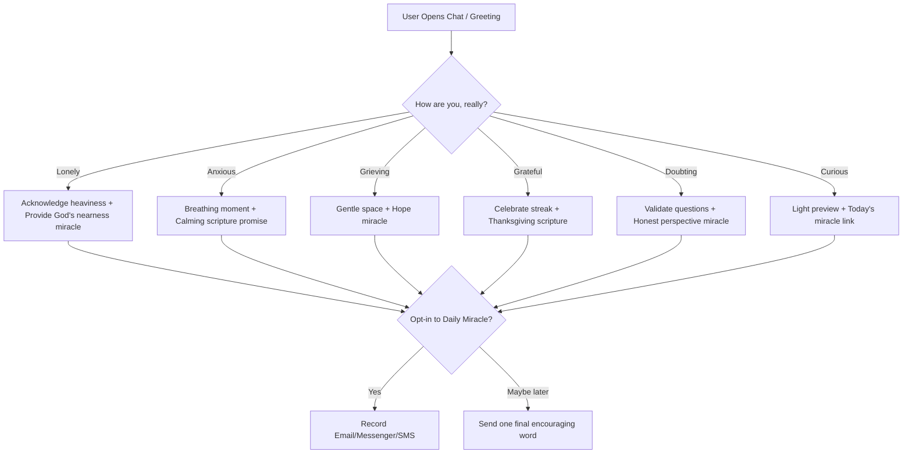

# Module F4: "Chat with Miracle" Companion — Technical Specification

This document specifies the script integrations, dynamic API triggers, conversational flows, and safety guardrails for **F4: "Chat with Miracle" companion**.

---

## 🎯 Objective
Establish an empathetic, conversational companion named **Miracle** using a chatbot widget (**Bonfire** or **ManyChat**). The widget listens first, acts Taglish-friendly, addresses primary emotions, offers comfort/miracles, and channels users toward double opt-in subscriptions with minimal custom AI model overhead.

With Payload CMS, chatbot-created leads and follow-up state should also be mirrored into Payload for admin review, safety workflows, and future email/SMS personalization.

---

## 📁 Files to Create / Modify

1. **[MODIFY]** `src/app/(frontend)/layout.tsx` — Load the widget script asynchronously.
2. **[NEW]** [ChatTrigger.tsx](file:///c:/RepoOutside/himala/src/components/landing/ChatTrigger.tsx) — Codebase buttons that open the chat widget.

---

## ✅ Implementation Status

Partially implemented on 2026-05-30.

### Completed

- Added the Bonfire widget config and script globally in `src/app/(frontend)/layout.tsx`.
- Widget ID: `0a2d4d30-6fa1-4b9e-a024-d649314a5f89`
- Script URL: `https://app.heybonfire.com/widget.js`
- Loaded through Next.js `Script`; the config uses `strategy="afterInteractive"` and the widget script uses `strategy="lazyOnload"` so the heavier third-party widget does not block the first render.

### Still Pending

- Configure the Bonfire conversation flow inside the Bonfire dashboard.
- Add or confirm distress keyword routing and crisis guardrail responses.
- Decide how Bonfire contacts will sync into Payload.
- Manually test that the widget appears and opens in-browser.
- Manually test that crisis keywords stop any subscription funnel and show the approved hotline message.
- Optional: add `ChatTrigger.tsx` if a custom in-page/floating button is still desired beyond Bonfire's default launcher and a supported Bonfire opener API is confirmed.

### Verification Status

- `npm run lint`: passed on 2026-06-27.
- `npm exec tsc -- --noEmit`: passed on 2026-06-27.
- `npm run build`: passed on 2026-06-27.
- Manual Bonfire widget QA: pending.

## 🛠️ Step-by-Step Code Specifications

### 1. Script Integration (`layout.tsx`)
Rather than blocking first-paint, inject the chat script lazily using Next.js `Script` tags.

```tsx
import Script from "next/script";

// Inside RootLayout:
<Script
  id="bonfire-widget-config"
  strategy="afterInteractive"
>
  {`
    window.BonfireWidgetConfig = {
      widgetId: "0a2d4d30-6fa1-4b9e-a024-d649314a5f89"
    };
  `}
</Script>
<Script
  src="https://app.heybonfire.com/widget.js"
  strategy="lazyOnload"
/>
```

---

### 2. Conversational Flows & Visual Builder Setup
The chatbot dialogues and paths are built inside the **Bonfire dashboard/builder**:



#### PH-Specific Crisis Guardrails:
* Set up a **Global Trigger Keyword Rule** inside the Bonfire builder.
* If a visitor types distress keywords (*suicide*, *magpakamatay*, *gusto ko nang mamatay*, *self-harm*, *hurt myself*):
  1. Immediately **stop** any automated subscription funnel.
  2. Send an empathetic canned message: *"Nandito kami para sa iyo. Hindi ka nag-iisa. Kung ikaw ay dumadaan sa matinding krisis, mangyaring makipag-ugnayan sa mga propesyonal na handang tumulong sa iyo 24/7..."*
  3. Display the **National Center for Mental Health (NCMH) Philippines** contact numbers:
     - Toll-free hotline: **1553**
     - Mobile: **0917-899-8727** / **0966-351-4518**

---

### 3. Programmatic Trigger Component (`ChatTrigger.tsx`)
Only provide custom floating buttons after confirming Bonfire exposes a supported JavaScript opener API. Until then, rely on Bonfire's default launcher:

```tsx
"use client";

import React from "react";
import { MessageSquareShare } from "lucide-react";

export default function ChatTrigger() {
  const openMiracleChat = () => {
    if ((window as any).gtag) {
      (window as any).gtag("event", "chatbot_opened_via_button", {
        trigger_location: "floating_trigger"
      });
    }
  };

  return (
    <button
      onClick={openMiracleChat}
      className="fixed bottom-6 right-6 z-40 bg-brand-gold hover:bg-brand-gold/90 text-brand-dark-brown p-4 rounded-full shadow-2xl flex items-center gap-2 font-bold transition-all hover:scale-105 active:scale-95 border border-brand-dark-brown/15"
    >
      <MessageSquareShare className="w-5 h-5" />
      <span className="hidden sm:inline text-xs uppercase tracking-wider">
        Kausapin si Miracle
      </span>
    </button>
  );
}
```

---

## 🧪 Manual Verification Instructions
1. Load the website page and confirm that the chat bubble or custom "Kausapin si Miracle" floating button loads correctly.
2. Click the button. Confirm that the chat drawer opens.
3. Test distress trigger keywords (e.g. *"gusto ko nang mamatay"*). Verify that the bot halts the email funnel instantly and outputs the NCMH hotlines with supportive crisis messaging.

## Payload CMS Integration

Recommended Payload collections:

- `leads`: chat-created contacts, email/phone, preferred channel, language, source.
- `chatContacts`: Bonfire contact ID, initial feeling, conversation status, crisis flag, follow-up owner.
- `events`: `chatbot_opened`, `chat_feeling_selected`, `chat_lead_created`, `chat_crisis_flagged`.

Recommended sync options:

1. Use Bonfire/ManyChat webhook or Zapier/Make automation to create/update Payload records.
2. If no webhook is available, export contacts periodically and import into Payload.
3. Keep crisis/safety notes access-restricted to admin/support roles only.
