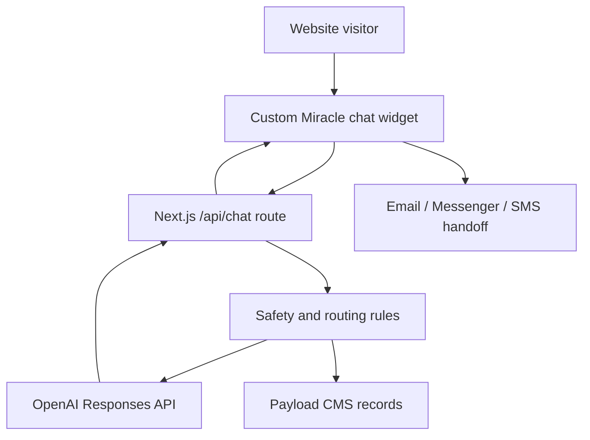

# Module F4: OpenAI "Chat with Miracle" Companion

This document replaces the Bonfire-first chatbot plan with a custom OpenAI-powered chat owned by the Himala codebase.

## Executive Answer

Yes, we can build our own chat with the OpenAI credentials already provided. We do not need the client to create or configure a Bonfire, ManyChat, or other third-party chatbot workspace for Stage 1.

What we still need from the client is approval, not platform setup:

- Final approval of Miracle's tone, Taglish behavior, and spiritual boundaries.
- Final approval of crisis wording and hotline list.
- Privacy and consent language for storing chat leads and conversation metadata.
- Confirmation of who owns production OpenAI billing and production environment variables.
- Approval of lead handoff destinations, such as email signup, Messenger, SMS, or staff follow-up.

Important: the OpenAI API key shared in chat must be rotated before production because it should be treated as exposed.

## Recommendation

Build a custom in-site chat widget and connect it to OpenAI through a server-side Next.js API route.

Do not put the OpenAI API key in browser code. The frontend should only call our own `/api/chat` endpoint. The server route should read `OPENAI_API_KEY` from environment variables, send user messages to OpenAI, apply safety instructions, and return Miracle's response.

Use OpenAI's Responses API as the long-term path. The provided Assistant ID can be used only as a temporary reference for the existing assistant instructions, because OpenAI documentation says the Assistants API is deprecated and scheduled for sunset on August 26, 2026.

References:

- OpenAI Responses API: https://developers.openai.com/api/docs/guides/text-generation
- Conversation state: https://developers.openai.com/api/docs/guides/conversation-state
- Assistants migration: https://developers.openai.com/api/docs/assistants/migration
- Deprecations: https://developers.openai.com/api/docs/deprecations

## What We Already Have

- A working Next.js frontend with global layout, landing components, capture flow, and CTA buttons.
- Existing Bonfire integration points that can be replaced:
  - `src/app/(frontend)/layout.tsx`
  - `src/lib/bonfire.ts`
  - `src/components/landing/CaptureForm.tsx`
  - `src/components/landing/HandoffModal.tsx`
- Payload CMS architecture for leads, contacts, events, and admin review.
- OpenAI Assistant ID for reference:
  - `asst_gREZGmZCqyZzeMXsnNxjpS1E`
- Initial OpenAI API access, pending key rotation.

## What We No Longer Need From Client

For the custom OpenAI chat path, we do not need:

- Bonfire dashboard access.
- Bonfire widget ID.
- Bonfire script.
- ManyChat account.
- ManyChat page widget.
- Facebook Page admin access for Stage 1 chat.
- Client-side chatbot builder configuration.

Those may still matter later if the client wants Messenger or Viber automation, but they are not required to launch the website chat.

## What We Still Need Client Approval For

### 1. Brand and Pastoral Voice

Miracle should be warm, gentle, Taglish-friendly, and spiritually encouraging. It should not sound like a therapist, pastor, doctor, or crisis counselor.

Client should approve:

- English and Tagalog tone.
- How directly Miracle references Jesus, prayer, scripture, and hope.
- Whether Miracle can recommend Himala content automatically.
- Whether Miracle should invite users to subscribe after every chat or only after emotional support.

### 2. Crisis Safety Protocol

Miracle must not continue a normal subscription funnel when a user expresses self-harm, suicide, abuse, or immediate danger.

Client should approve:

- The crisis message.
- The hotline list.
- Whether to include staff follow-up instructions.
- Whether chat crisis events are stored in Payload and who can view them.

Default Philippines crisis contacts currently used in the older F4 plan:

- NCMH Crisis Hotline: `1553`
- Mobile: `0917-899-8727`
- Mobile: `0966-351-4518`

### 3. Privacy and Consent

Client should approve what we store and how we disclose it.

Suggested Stage 1 storage:

- Session ID.
- Preferred language.
- Initial feeling.
- Lead email or phone only when explicitly provided.
- Consent status.
- Crisis flag, if triggered.
- Short conversation summary, not necessarily full transcript.

Avoid storing full sensitive transcripts unless the client has a clear retention and access policy.

### 4. Production Ownership

Client should confirm whether OpenAI usage is billed to:

- The developer's temporary OpenAI project during development.
- A client-owned OpenAI project before launch.
- A shared organization account controlled by the project owner.

Production should use a client-owned or project-owned OpenAI account, not a personal temporary key.

## Proposed Architecture



## Files To Create Or Modify

### Create

- `src/components/landing/MiracleChatWidget.tsx`
  - Floating launcher, chat panel, message list, input, loading state, and close/minimize state.

- `src/app/api/chat/route.ts`
  - Server-side OpenAI call.
  - Applies system instructions.
  - Detects crisis keywords before sending normal chat response.
  - Returns structured response to frontend.

- `src/lib/openai-chat.ts`
  - Shared server helper for prompts, model selection, safety response, and response parsing.

- `src/lib/chat-safety.ts`
  - Crisis keyword detection and safety response helpers.

### Modify

- `src/app/(frontend)/layout.tsx`
  - Remove Bonfire script config.
  - Mount `MiracleChatWidget`.

- `src/lib/bonfire.ts`
  - Replace or remove after all call sites move to the custom chat opener.

- `src/components/landing/CaptureForm.tsx`
  - Replace `openBonfireChat()` with custom chat open event.

- `src/components/landing/HandoffModal.tsx`
  - Replace preview channel behavior with custom chat open event.

- Payload collections, if Stage 1 chat persistence is included:
  - `leads`
  - `chatContacts`
  - `events`

## Environment Variables

Development and production should use environment variables only:

```bash
OPENAI_API_KEY=...
OPENAI_MODEL=gpt-5.5
OPENAI_CHAT_SYSTEM_PROMPT_VERSION=miracle-v1
```

Optional temporary variable:

```bash
OPENAI_ASSISTANT_ID=asst_gREZGmZCqyZzeMXsnNxjpS1E
```

The Assistant ID is not secret. The API key is secret and must never be committed, logged, or sent to the browser.

## Chat Behavior

### Greeting

Miracle opens gently and asks how the visitor is doing.

Example:

> Hi, I'm Miracle. Kumusta ka today? You can tell me in English, Tagalog, or Taglish.

### Supported Emotional Paths

The chat should respond well to:

- Lonely.
- Anxious.
- Grieving.
- Grateful.
- Doubting.
- Curious.
- Looking for prayer.
- Looking for daily encouragement.

### Subscription Handoff

After responding with care, Miracle can invite the visitor to receive daily miracles.

The handoff should capture:

- Preferred language.
- Preferred channel.
- Email or phone, if given.
- Source: `chat`.
- Initial feeling.
- Consent state.

### Boundaries

Miracle should not:

- Claim to be human.
- Claim to be a licensed counselor.
- Give medical, legal, or financial advice.
- Provide instructions for self-harm.
- Argue theology aggressively.
- Pressure users into subscription.
- Store sensitive information without consent.

## Crisis Handling

Before sending a normal OpenAI response, the server should check for high-risk phrases such as:

- `suicide`
- `kill myself`
- `hurt myself`
- `self-harm`
- `gusto ko nang mamatay`
- `magpakamatay`
- `saktan ang sarili`
- `ayoko na mabuhay`

If triggered:

1. Stop the normal funnel.
2. Return an approved crisis response.
3. Show NCMH hotline information.
4. Create a restricted Payload event if persistence is enabled.
5. Do not ask marketing or subscription questions in that response.

## Data Model

Recommended Payload fields for `chatContacts`:

- `sessionId`
- `lead`
- `preferredLanguage`
- `initialFeeling`
- `conversationStatus`
- `crisisFlag`
- `summary`
- `lastMessageAt`
- `followUpOwner`
- `consentStatus`

Recommended event names:

- `chatbot_opened`
- `chat_message_sent`
- `chat_feeling_detected`
- `chat_lead_created`
- `chat_crisis_flagged`
- `chat_subscription_handoff_clicked`

## Implementation Phases

### Phase 1: Replace Bonfire UI

- Build the custom chat widget.
- Add server-side `/api/chat`.
- Remove Bonfire script.
- Replace `openBonfireChat()` call sites.
- Use in-memory or browser-session conversation state only.

### Phase 2: Add Payload Persistence

- Store chat leads and chat events.
- Save conversation summary.
- Add admin review fields.
- Add consent and retention handling.

### Phase 3: Add Advanced Handoff

- Connect chat leads to email/SMS delivery flows.
- Add Messenger/Viber only if the client later wants off-site messaging.
- Add staff follow-up workflow for flagged conversations.

## Acceptance Criteria

- No Bonfire script loads on the frontend.
- No OpenAI key is exposed to browser code.
- Visitor can open, close, and send messages in the Miracle chat widget.
- Chat supports English, Tagalog, and Taglish.
- Crisis keywords return the approved hotline response.
- Chat can invite users into the existing subscription flow.
- Chat open and handoff events are tracked.
- Production uses a rotated OpenAI key stored in hosting environment variables.

## Final Position

We can proceed without waiting for client chatbot platform setup. The client is no longer a blocker for Bonfire, ManyChat, or widget access.

Client approval is still needed before production for tone, safety, privacy, and ownership decisions. Development can begin now using our own OpenAI-backed chat architecture.
