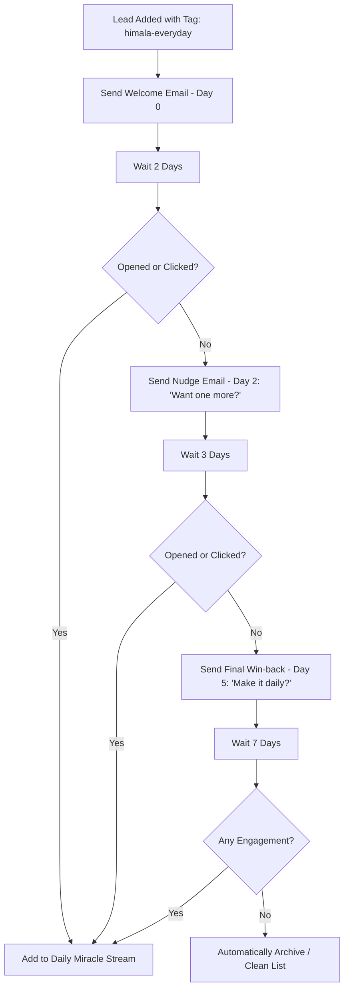

# Module F6: Email Delivery & Follow-Up — Configuration Specification

This document details the configuration layouts, user triggers, nurturing sequences, Payload CMS records, and Data Privacy Act compliance patterns for **F6: Email Delivery & Follow-up**.

---

## 🎯 Objective
Configure the external email marketing automation system (e.g., **ActiveCampaign**, **Mailchimp**, or **Brevo**) to receive captured leads, tag them correctly, deliver daily miracles, and run nudge paths for inactive readers with zero manual management.

---

## 📋 Responsibilities Matrix

* **Website Team**: Captures input fields, selected channel, language, origin page, UTM values, and consent; writes the operational record to Payload.
* **Payload CMS**: Stores leads, subscription state, message templates, segments, unsubscribe/suppression state, and delivery logs.
* **Email System Administrator**: Configures the actual sending provider, scheduler crons, provider automations, and welcome journeys.

---

## 🛠️ Email Automation Specifications

### 1. Automation Flowchart (Nurture Sequence)
The following sequence triggers after a Payload `lead` has confirmed email consent and is synchronized with the chosen email provider:

---

### 2. Segment & Tagging Rules
To deliver localized Tagalog / English content accurately, Payload leads and the email provider must carry matching properties:

| Tag Name | Target Value | Purpose |
| :--- | :--- | :--- |
| `himala-lang` | `tl` / `en` | Directs user to the Tagalog or English sequence. |
| `himala-source` | `landing` / `referral` / `chat` | Monitors where the user subscribed to compute acquisition funnels. |
| `himala-feeling` | `lonely` / `anxious` / `grieving` / etc. | Stores the initial emotion logged in F4 to customize the first email. |

---

### 3. Payload Collections for Email

Payload should become the source of truth for email state, even when a provider such as Brevo, Mailchimp, or ActiveCampaign sends the actual messages.

Recommended collections:

- `leads`: email, language, preferred channel, consent, source, UTM values, provider contact ID.
- `messageTemplates`: reusable welcome, nudge, win-back, and daily miracle templates.
- `deliveryLogs`: provider, provider message ID, status, sent timestamp, delivered timestamp, error.
- `events`: first-party lifecycle events such as `email_opt_in_started`, `email_opt_in_confirmed`, `email_unsubscribed`.

Recommended lead fields:

- `email`
- `language`
- `preferredChannel`
- `consentEmail`
- `consentAt`
- `doubleOptInStatus`
- `emailProvider`
- `emailProviderContactId`
- `unsubscribeAt`
- `suppressionReason`

---

### 4. Data Privacy Act (DPA) Compliance for Philippines
To adhere to the **Philippine Data Privacy Act of 2012 (DPA)**, the subscription and delivery system must support the following:

1. **Active Affirmative Consent**: The checkbox on the web forms must not be pre-checked. Copy must explicitly state: *"Sumasang-ayon ako na makatanggap ng pang-araw-araw na email ng pag-asa. Pwede akong mag-unsubscribe anytime."*
2. **Double Opt-in Sequence**: Immediately send a confirmation email containing a link before adding the user to the active daily broadcast.
3. **One-Click Unsubscribe**: Every single email template must contain a clearly visible footer link: *"Ayaw ko na makatanggap nito? Mag-unsubscribe dito"* (Unsubscribe here) that triggers instant deletion from active lists.
4. **Data Privacy Policy Page**: Ensure the footer link maps to a comprehensive privacy page detailing how data is kept safe, secure, and never sold to third parties.
5. **Payload Audit Trail**: Store consent timestamp, source, unsubscribe timestamp, and deletion/export request status in Payload.
