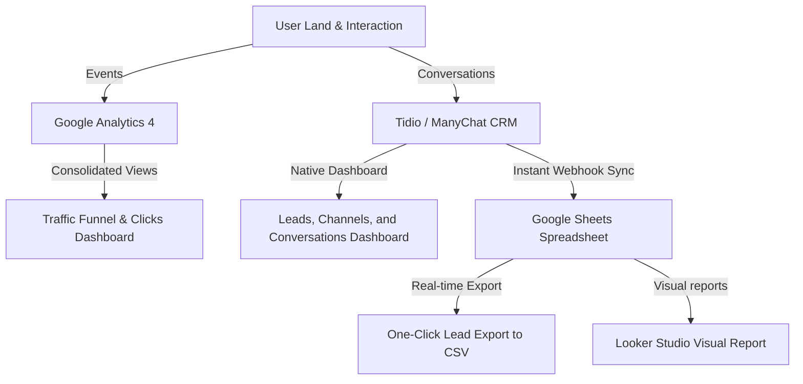

# Module F8: Basic Admin Dashboard — SaaS & No-Code Specification

This document specifies the dashboard tracking metrics, custom Google Analytics funnel setups, and database-less lead spreadsheet sync structures for **F8: Basic Admin Dashboard**.

---

## 🎯 Objective
Empower the ministry team with a single clear view of signups, chat activity, referrals, and leads *without building a custom database, admin authentication flows, or dynamic report pages* in Next.js. This maximizes data security and keeps codebase complexity at zero.

---

## 📊 Core Metrics to Track

The ministry needs weekly visibility into:
1. **Landing Traffic**: Views, bounce rates, average session durations (GA4).
2. **Action Click Funnel**: Views $\rightarrow$ input interactions $\rightarrow$ redirect clicks (GA4).
3. **Chat Activity**: Opens, finished chatbot paths, feeling frequencies (Tidio/ManyChat).
4. **Acquisitions**: Total emails collected, messaging subscribers (Tidio/ManyChat/Email Tool).
5. **Referral Performance**: Shares triggered, clicks on referral pages (GA4).

---

## 🛠️ Implementation Architecture

To deliver this database-less dashboard, we combine three pre-existing SaaS consoles:

---

## 🛠️ Step-by-Step Configuration Specifications

### 1. Google Analytics 4 (GA4) Custom Funnel Setup
Configure a custom funnel report in the GA4 Explorer Console:
* **Step 1: Land** (Event: `page_view` where Page Path is `/`)
* **Step 2: CTA Focus** (Event: `form_focus` or `cta_clicked`)
* **Step 3: Intent** (Event: `handoff_started` when the transition modal triggers)
* **Step 4: Subscribe** (Monitored on off-site `Jesus.net` conversion pages)

*This funnel lets you calculate exact user drop-off points in real-time.*

---

### 2. Tidio / ManyChat CRM & Leads Sync
All chat contacts are automatically recorded in the widget's CRM.
* **Lead List Export**: Admins can log into the Tidio Console, navigate to **Contacts**, filter by tag (`himala-everyday`), and click **Export to CSV**.
* **Segment View**: Define saved custom contact views inside the CRM based on channel choice (Email, Messenger, Viber).

---

### 3. Google Sheets & Looker Studio (Combined Consolidated Dashboard)
If the ministry wants a single screen to view all details without logging into multiple tools:

1. **Automation (Tidio to Google Sheets)**: Toggle the native Tidio Google Sheets integration (or set up a simple one-step Zapier/Make webhook). Every time a contact is created or tagged `himala-everyday`, a new row is instantly appended:
   `[Date, Email/Phone, Selected Language, Feeling Shared, Acquisition Channel, UTM Source]`
2. **Looker Studio Dashboard**: Connect a free Google Looker Studio dashboard directly to that Google Sheet. This generates beautiful, interactive pie charts (for Tagalog vs English, or Lonely vs Grieving) and lists that update automatically.
