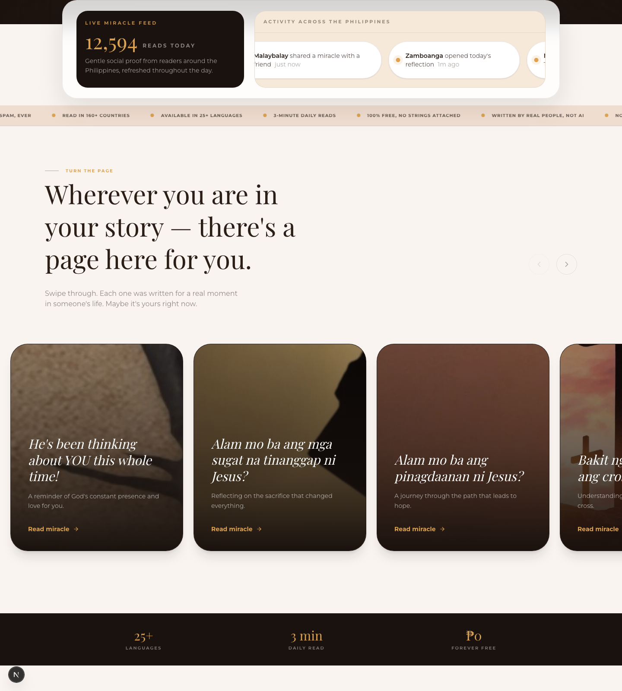
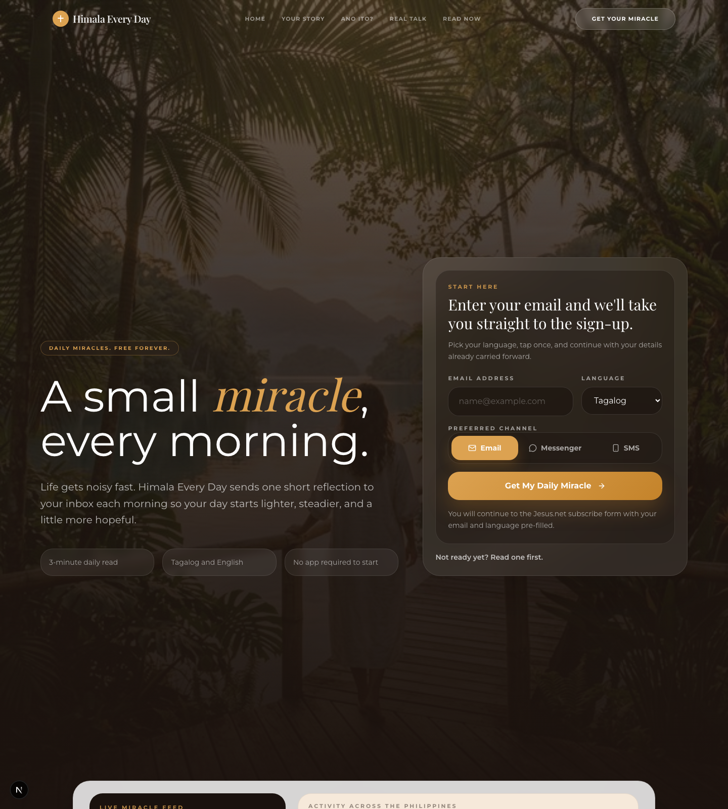
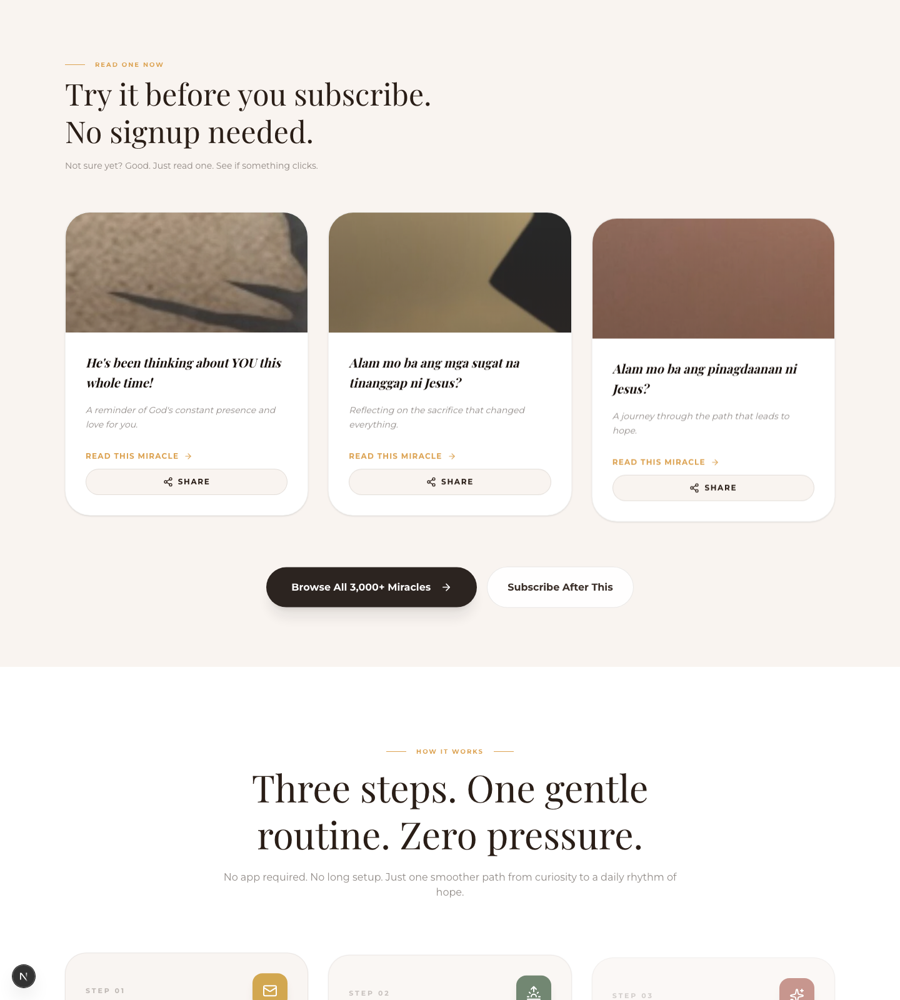
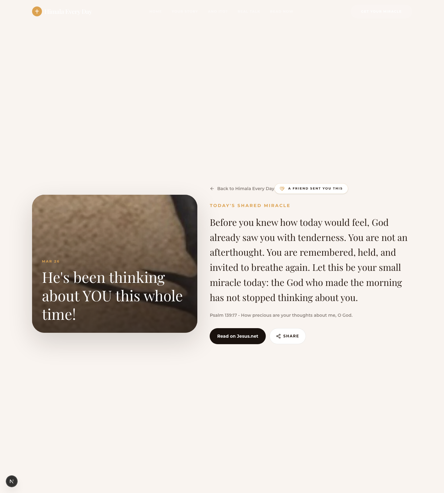
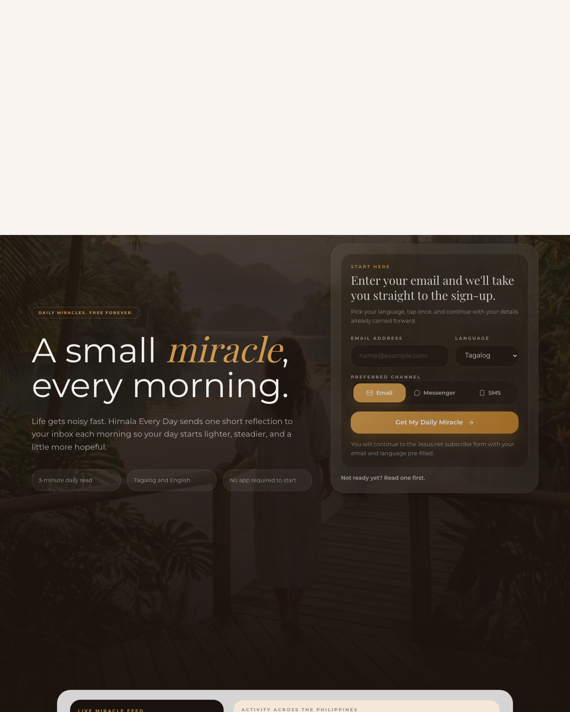
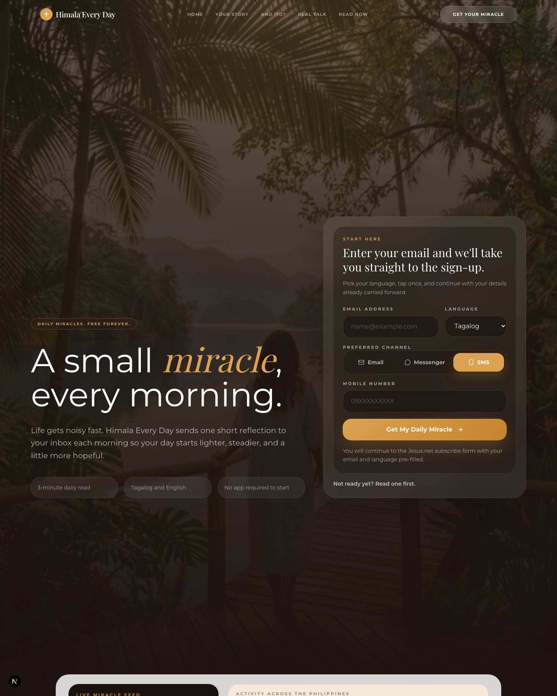
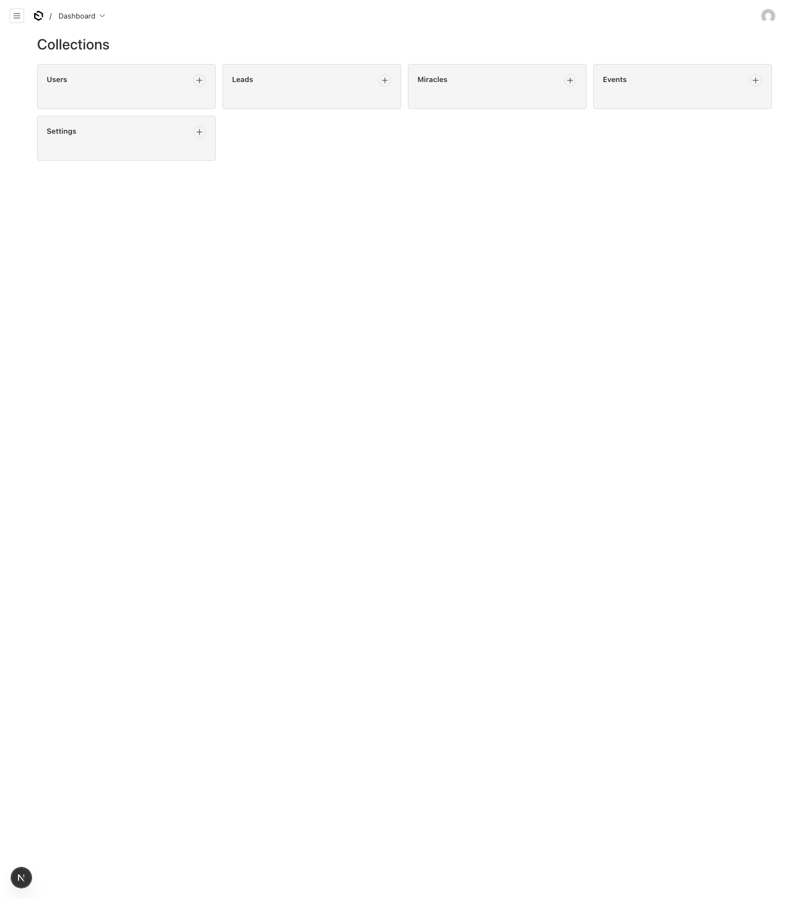
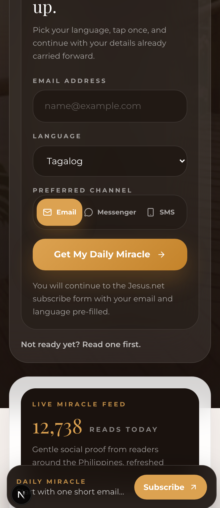

# Himala Every Day - Phase 2 Feature Progress

Last updated: 2026-06-27

This document lists Phase 2 progress by feature/module. Each section includes the current status, the changes already made, screenshot evidence from the local run, and what is still needed from the client before production launch.

## Local Run Verification

- Local URL: `http://localhost:3000`
- Homepage `/`: `200 OK`
- Payload admin `/admin`: `200 OK`
- `npm run lint`: passed on 2026-06-27
- `npm exec tsc -- --noEmit`: passed on 2026-06-27
- `npm run build`: passed on 2026-06-27

## Screenshot Index

| Feature | Screenshot |
| --- | --- |
| F1 Button redirect / CTA flow | `docs/phase-2/screenshots/phase2-f1-button-redirect-cta-only-2026-06-05.png` |
| F2 Landing upgrades | `docs/phase-2/screenshots/phase2-f2-landing-upgrades-2026-06-05.png` |
| F3 Live feed | `docs/phase-2/screenshots/phase2-f3-live-feed-2026-06-05.png` |
| F4 chat widget embed evidence | `docs/phase-2/screenshots/phase2-f4-chat-widget-2026-06-05.png` |
| F5 Share buttons UI | `docs/phase-2/screenshots/phase2-f5-share-buttons-ui-2026-06-05.png` |
| F5 Referral page | `docs/phase-2/screenshots/phase2-f5-referral-page-2026-06-05.png` |
| F7 SMS channel state | `docs/phase-2/screenshots/phase2-f7-sms-channel-2026-06-05.png` |
| F8 Payload admin dashboard | `docs/phase-2/screenshots/phase2-f8-payload-admin-2026-06-05.png` |
| F9 Mobile sticky CTA | `docs/phase-2/screenshots/phase2-f9-sticky-cta-mobile-2026-06-05.png` |

## F1 - Button Redirect / CTA Flow

**Status:** Confirmed scope updated. Client confirmed F1 should be treated as a simple button redirect/navigation flow to the relevant destination pages, not as a required full on-site capture and Payload handoff workflow.

**Progress and changes:**

- Added clear CTA entry points on the landing page.
- Header, hero, content sections, final CTA, and mobile sticky CTA provide paths for the user to continue.
- The expected F1 launch behavior is that buttons redirect users to the approved destination page or section.
- Existing previous work includes an enhanced capture form and Payload lead-write path, but this should be considered optional/supporting work unless the client later asks to keep first-party capture.
- CTA tracking hooks are available for measuring button clicks.

**Screenshot:**


**Still needed from client:**

- Confirm the final redirect URL for the primary CTA.
- Confirm the final redirect URL or page anchor for secondary CTAs such as "Read one first."
- Confirm whether CTA buttons should open in the same tab or a new tab when linking to external pages.
- Confirm if the current email capture UI should be simplified into plain buttons for production launch.

## F2 - Landing Page Upgrades

**Status:** Done in code. Needs final client content/design review.

**Progress and changes:**

- Rebuilt the first screen around the daily miracle offer and capture form.
- Added stronger story/content sections.
- Added carousel-style miracle cards.
- Added stats ribbon and clearer "what is this" section.
- Added FAQ and final CTA sections lower on the page.
- Improved visual hierarchy, image usage, and repeated conversion points.

**Screenshot:**


**Still needed from client:**

- Final review of copy, Tagalog/English wording, and tone.
- Final review of images and miracle card content.
- Confirm whether any section should be removed or reordered before launch.

## F3 - Live Miracle Feed

**Status:** Done in code. Optional future upgrade can connect it to real activity data.

**Progress and changes:**

- Added `LiveFeed.tsx`.
- Shows a daily reads counter.
- Shows localized activity across the Philippines.
- Mounted near the top of the landing page for social proof.
- The current version is display/local logic, not a production analytics feed yet.

**Screenshot:**



**Still needed from client:**

- Confirm if the feed can remain as lightweight social proof for Stage 1.
- If real-time data is required later, confirm which data source should power it: Payload events, GA data, or another analytics source.

## F4 - Bonfire Chatbot

**Status:** Partial / Pending Client. The Bonfire widget config and script are embedded in code; the Bonfire dashboard flow still needs final client-owned setup and manual QA.

**Progress and changes:**

- Added Bonfire config and script loading to `src/app/(frontend)/layout.tsx`.
- Current Bonfire widget ID:

```txt
0a2d4d30-6fa1-4b9e-a024-d649314a5f89
```

- Current script:

```txt
https://app.heybonfire.com/widget.js
```

- The config is loaded with Next.js `Script` using `strategy="afterInteractive"`; the widget script uses `strategy="lazyOnload"`.
- This confirms the site-level integration point is ready.

**Screenshot:**



**Note:** The screenshot is legacy local evidence for the chat-widget integration area. Final Bonfire widget open/conversation QA should be done manually in a real browser after the client-owned Bonfire project is configured.

**Still needed from client:**

- Create or confirm the official client-owned Bonfire workspace/project.
- Confirm the official production Bonfire widget ID and widget script.
- Add the production domain inside Bonfire.
- Invite the developer only as temporary admin/operator during setup.
- Approve chatbot name, tone, language behavior, tags, and routing.
- Confirm crisis/escalation copy and hotline references.
- Review privacy/DPA settings for client data policy.

**Recommended setup based on requirement:**

- Keep Bonfire for Stage 1 because the code integration is already done.
- Confirm the current widget ID belongs to the client-owned Bonfire project before launch.
- Use a simple bot named `Miracle` or a client-approved name.
- Start with these flows:
  - Greeting and language preference.
  - "How are you feeling today?" quick replies.
  - Offer daily miracle subscription.
  - Collect email only after consent.
  - Route crisis/self-harm language to approved hotline/ministry support copy.
  - Offer Messenger/SMS only when those channels are ready.
- Align Bonfire tags with Payload fields where possible: language, source, feeling, preferred channel, and consent state.

Helpful Bonfire reference:

- Widget script: https://app.heybonfire.com/widget.js

## F5 - Referral Loop

**Status:** UI implemented / approval pending. Static referral/share flow is implemented, but final client approval, manual QA, and Payload migration are still needed.

**Progress and changes:**

- Added shared miracle content in `src/lib/miracle-content.ts`.
- Added `MiracleShareButton.tsx` with Web Share API support and clipboard/prompt fallback.
- Added dynamic referral pages under `/share/[miracleId]`.
- Added referral page analytics tracking.
- Updated sample miracles to use the shared content source and show share buttons.

**Where to see it in the UI:**

- It is not a separate top-level navigation page.
- On the homepage, go to the `Read Now` / sample miracles section.
- The referral entry point is the `Share` button shown on each miracle card.
- When a shared link is opened, the recipient lands on a `/share/[miracleId]` referral page.

**Current referral URLs:**

- `/share/hes-been-thinking-about-you`
- `/share/alam-mo-ba-ang-mga-sugat-ni-jesus`
- `/share/alam-mo-ba-ang-pinagdaanan-ni-jesus`

**Screenshots:**

Homepage share buttons:



Referral landing page:



**Still needed from client:**

- Approve or replace the three miracle messages.
- Confirm scripture references.
- Confirm final share text.
- Confirm images and original Jesus.net URLs.
- Confirm if the `Share` buttons should remain visible on the homepage cards before launch.
- Decide when miracle content should move from static code to Payload CMS.

## F6 - Email Configuration

**Status:** Stage 2 / Pending Client. Data capture is ready, but the email provider is not configured yet.

**Progress and changes:**

- Email is the default preferred channel in the capture form.
- Payload lead records can store email, language, source, consent, and opt-in status.
- The data model is ready for provider sync and delivery logging.

**Screenshot evidence:**

The current enhanced capture UI still shows email as the default channel, but this belongs to optional/supporting email setup rather than the confirmed redirect-only F1 scope:



**Still needed from client:**

- Choose the provider: Brevo, Mailchimp, or ActiveCampaign.
- Provide API key and list/audience ID.
- Confirm sender name and sender email.
- Provide or approve English and Tagalog email templates.
- Enable double opt-in.
- Confirm unsubscribe/suppression handling.

**Recommendation:**

- Use Brevo first if the client wants the simplest and most cost-conscious setup.
- Use ActiveCampaign only if advanced automation trees are required.
- Keep Payload as the source of truth for subscriber state and consent, even if the email provider sends the actual messages.

## F7 - SMS Delivery

**Status:** Stage 2 / Pending Client. SMS preference capture is implemented, but actual SMS sending is not yet connected.

**Progress and changes:**

- Semaphore API key is stored locally in `.env.local` and is not committed.
- Local sender name is set to `HIMALA`.
- The form can capture SMS as preferred channel.
- When SMS is selected, the form shows a Philippine mobile number field.
- Server validation checks Philippine mobile number format before storing the lead.
- Payload lead records can store phone number, SMS consent, preferred channel, and handoff status.

**Screenshot:**



**Still needed from client:**

- Confirm the Semaphore key belongs to the production account.
- Add `SEMAPHORE_API_KEY` and `SEMAPHORE_SENDER_NAME` to production hosting.
- Confirm Sender ID approval for `HIMALA` or the final brand name.
- Load starting SMS credits.
- Approve SMS consent language.
- Approve SMS templates and unsubscribe wording.

**Recommendation:**

- Keep SMS as Stage 2 until Sender ID, credits, opt-in wording, and unsubscribe handling are confirmed.
- Use short, trackable links in SMS messages.
- Store Semaphore message IDs, delivery status, opt-in status, and unsubscribe events in Payload.

## F8 - Admin SaaS / Payload CMS

**Status:** Partial. Payload admin foundation is installed, reachable locally, and verified with an admin login. Production admin setup is still needed.

**Progress and changes:**

- Installed Payload CMS with Supabase Postgres adapter.
- Added frontend and Payload route groups so public pages and admin pages can coexist.
- Added initial collections:
  - `users`
  - `leads`
  - `miracles`
  - `events`
  - `settings`
- `/admin` and `/admin/login` resolve locally.
- Admin login was verified locally and the dashboard shows the initial collections.
- Previous enhanced capture work can write/update Payload `leads` and create `handoff_started` events if the client later chooses to keep first-party capture.

**Screenshot:**



**Still needed from client:**

- Confirm production Supabase database.
- Add production `DATABASE_URL`.
- Generate and add strong production `PAYLOAD_SECRET`.
- Confirm admin users and roles.
- Confirm who can view/export/delete leads.
- Confirm backup, retention, export, and deletion policy for Data Privacy Act compliance.

**Recommendation:**

- Use Payload as the source of truth for leads, content, consent, referrals, operational events, and delivery logs.
- Give full Admin access only to the technical/project owner.
- Give ministry/content staff Editor, Support, or Viewer access based on their actual workflow.

## F9 - UI/UX Refinements and Tracking

**Status:** Done in code / QA Pending. Visual refinements are implemented, but analytics needs production/browser verification.

**Progress and changes:**

- Added mobile sticky CTA.
- Added CTA tracking hooks.
- Improved image loading behavior.
- Removed/replaced dead language-link behavior.
- Added repeated conversion points across the page.
- Improved cards, share actions, and section flow.

**Screenshot:**



**Still needed from client:**

- Confirm GA property ownership/access.
- Verify GA events in DebugView after deployment.
- Complete manual responsive QA on desktop, tablet, and mobile.
- Confirm final privacy/consent copy.

## Production Environment Needed

The client or production admin should configure these values securely in the hosting provider. Do not commit real secrets to the repository or paste them into public docs.

```env
# Payload CMS / Supabase
DATABASE_URL=postgresql://...
PAYLOAD_SECRET=generate-a-strong-production-secret

# Email provider
EMAIL_PLATFORM_API_KEY=...
EMAIL_LIST_ID=...

# Semaphore SMS
SEMAPHORE_API_KEY=...
SEMAPHORE_SENDER_NAME=HIMALA
```

## Recommended Launch Order

1. Client creates/owns the official Bonfire project and confirms the final widget ID and widget script.
2. Add production `DATABASE_URL` and `PAYLOAD_SECRET`.
3. Create production Payload admin users and roles.
4. Confirm final CTA redirect URLs.
5. Confirm final consent/privacy copy.
6. Run full manual QA for capture, referral pages, admin, Bonfire, mobile layout, and analytics.
7. Re-run `npm run build` before deployment.
8. Deploy Stage 1.
9. Start Stage 2 email/SMS delivery only after provider, consent, templates, Sender ID, and compliance requirements are approved.
